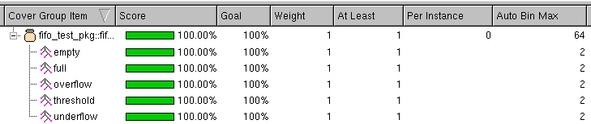

# Introduction

This GitHub repository contains the RTL design and UVM testbench for a synchronous FIFO.

Since this is my first UVM project, some learning notes are also included.

💫 = Key project highlights =💫 

- UVM
- Reactive stimulus generation
- Stand-alone assertion module using bindfile
- Functional coverage

# RTL Design

The synchronous FIFO design consists of 3 modules:

1. `fifo` module - top-level module, used for connecting `fifo_ctrl` and`reg_file` 
2. `fifo_ctrl` module - controller module, responsible for:
    1. Calculating and maintaining read and write memory pointers (addresses).
    2. Computing status flags (empty, full, underflow, overflow) and updating count.
3. `reg_file` module - memory module

The FIFO supports 3 operations:

1. Read
2. Write
3. Read and write in the same cycle

## Interface Signals


| Signal | Direction | Width | Description |
| --- | --- | --- | --- |
| `wr` | Input | 1-bit | Enables `wr_data` to be written to FIFO if FIFO is not full. |
| `rd` | Input | 1-bit | Reads data from FIFO onto `rd_data` if FIFO is not empty. |
| `wr_data` | Input | Parameterized. (Default: 8-bits) | The data to be written to FIFO when `wr_data` is asserted and FIFO is not full. |
| `trig_level` | Input | Parameterized. (Default: 4-bits) | When FIFO `count` ≥ `trig_level`(trigger level), `thr_trig` (threshold triggered) will be asserted. Default = 14. |
| `clk` | Input | 1-bit | Clock. |
| `rst` | Input | 1-bit | Asynchronous reset. |
| `rd_data` | Output | Parameterized. (Default: 8-bits) | Data read from FIFO when `rd_data` is asserted and FIFO is not empty. |
| `count` | Output | Parameterized. (Default: 5-bits) | FIFO element count. Default FIFO depth = 16. |
| `full` | Output | 1-bit | FIFO full flag. Asserted when `count` = FIFO depth. |
| `empty` | Output | 1-bit | FIFO empty flag. Asserted when  `count` = 0. |
| `overflow` | Output | 1-bit | FIFO overflow flag. Asserted when FIFO is full and `wr` = 1. |
| `underflow` | Output | 1-bit | FIFO underflow flag. Asserted when FIFO is empty and `rd` = 1. |
| `thr_trig` | Output | 1-bit | FIFO threshold triggered flag. Asserted when `count` ≥ `thr_trig`. |

# UVM Testbench

## Testbench Architecture


UVM testbench structure can be printed using `this.print()` inside the test class’s `end_of_elaboration_phase`.


## Tests

The current testbench contains 3 tests extended from the base test class `fifo_base_test`.

1. `fifo_test1`
2. `fifo_test2`
3. `fifo_rand_test`

### Base Test Class (`fifo_base_test`)

Inside the `run_phase` task of the base test class, a `fifo_base_seq` is started on the environment’s agent’s sequencer.

```verilog
// Inside fifo_base_seq class:

virtual task run_phase (uvm_phase phase);
  fifo_base_seq seq = fifo_base_seq::type_id::create("seq");
  phase.raise_objection(this);
  seq.start(env.agt.sqr);
  phase.drop_objection(this);
endtask
```

### Extended Test Classes

Through polymorphism, the extended test classes apply UVM factory type overrides inside their `build_phase` to replace the base sequence type with their respective sequences.

- `fifo_test1` - runs `fifo_seq1`
- `fifo_test2` - runs `fifo_seq2`
- `fifo_rand_test` - runs `fifo_rand_seq`

`fifo_seq1` , `fifo_seq2`, and `fifo_rand_seq` are sequence classes extended from the base sequence class (`fifo_base_seq`).

```verilog
// Inside fifo_rand_test class:

virtual function void build_phase (uvm_phase phase);
	super.build_phase(phase);
	// Applying factory type override
  set_type_override_by_type(fifo_base_seq::get_type(), fifo_rand_seq::get_type());
endfunction
```

Type overrides can be verified using `uvm_factory`'s `print()` method:


## Sequences & Reactive Stimulus Techniques

The testbench applies UVM reactive stimulus technique described in Clifford E. Cummings’ [paper](http://www.sunburst-design.com/papers/CummingsDVCon2020_UVM_ReactiveStimulus.pdf) to enable granular control over stimulus generation based on DUT feedback through driver.

### Base Sequence Class (`fifo_seq_base`)

The base sequence class provides both direct testing and random testing mechanisms.

- Random testing: randomizing the FIFO write data and operations (read/write/read and write).
- Direct testing: utilizing DUT response to allow the sequence to have finer control. Stimuli are generated in the direction to uncover edge cases.
    - Example: Keep reading from FIFO until empty, keep writing to FIFO until full.
    
    ```verilog
    // Inside fifo_seq_base class:
    
    task fifo_base_seq::write (fifo_transaction tr);
      if(!(tr.randomize() with {op == WRITE; rst = 1'b0;})) `RANDOMIZE_FAIL
      start_item(tr);
      finish_item(tr);
      get_response(rsp);
      `uvm_info("SEQ WR RSP", rsp.convert2string(), UVM_DEBUG)
    endtask: write
    
    task fifo_base_seq::write_until_full (fifo_transaction tr);
      `uvm_info("SEQ", "Write until full...", UVM_DEBUG)
      // Applying reactive stimulus technique
      while (!rsp.full) write(tr);
    endtask: write_until_full
    ```
    

### Extended Sequence Classes

- `fifo_seq1` and `fifo_seq2` applies the reactive stimulus technique as shown below:
    
    ```verilog
    // Inside fifo_seq2 class:
    
    task body();
      fifo_transaction tr = fifo_transaction::type_id::create("tr");
      
      repeat (2) reset(tr);
      write_until_full(tr);
      repeat (20) read_write(tr);
      read_until_empty(tr);
      repeat (10) read(tr);
      repeat (10) write(tr);
      
      repeat (5) reset(tr);
      repeat (20) read_write(tr);
      ...
    endtask
    ```
    
- `fifo_rand_seq` does not depend on the DUT’s response, operations are generated randomly.
    
    ```verilog
    // Inside fifo_rand_seq class:
    
    task body();
      fifo_transaction tr = fifo_transaction::type_id::create("tr");
      repeat (2) reset(tr);
      repeat (500) begin
          random_op(tr);
      end
    endtask
    ```
    

## Driver

As a part of reactive stimulus generation, the driver needs to send the DUT’s response back to the sequence for every transaction.

```verilog
task run_phase (uvm_phase phase);
  fifo_transaction tr;

  super.run_phase(phase);
  initialize_dut();
  forever begin
      seq_item_port.get_next_item(tr);

      if (tr.rst == 1)
          reset_dut(tr, rsp);
      else
          drive_dut(tr, rsp);

			// Sends DUT response back to sequence
      rsp.set_id_info(tr);
      seq_item_port.item_done(rsp);
  end
endtask
```

## Scoreboard

The scoreboard contains a behavioral FIFO model (`fifo_model` class) implemented using SystemVerilog’s queue. 

In order for scoreboard to be able to respond to asynchronous resets, a sticky `reset` bit is used inside the FIFO interface to capture `rst`. The monitor clocking block samples the sticky reset bit instead of `rst`.

```verilog
// Inside fifo_if:

//----------------------------------------------------
// Sticky reset bit used to capture asynchronous rst
//----------------------------------------------------
always_ff @(posedge clk, posedge rst)
begin
  // rst is the actual interface siganl, reset is a sticky bit
  if (rst) reset <= 1'b1;
  else reset <= 1'b0;
end

clocking monitor_cb @(posedge clk);
  default input #1step output #2ns;
  input reset;  // sticky reset bit is monitored instead of rst
  input wr, rd;
  input wr_data, rd_data;
  input full, empty;
  input overflow, underflow;
  input thr_trig;
endclocking
```

## Functional Coverage

Functional coverage is collected using `fifo_rand_test` running `fifo_rand_seq`.

100% functional coverage is achieved on the following cover groups:

```verilog
covergroup fifo_operation;
  op: coverpoint tr.op {
      bins read = { READ };
      bins write = { WRITE };
      bins read_write = { READ_WRITE };
  }
endgroup

covergroup fifo_status;
  full:      coverpoint tr.full;
  empty:     coverpoint tr.empty;
  overflow:  coverpoint tr.overflow;
  underflow: coverpoint tr.underflow;
  threshold: coverpoint tr.thr_trig;
endgroup
```




## Assertion

Assertion module (`fifo_assertion`) is separate from DUT module. A bind file is used to bind the two.

The assertion checks the following:

1. Check after reset that all read/write pointers, counter, and flags are properly reset.
2. Check FIFO empty flag is asserted when FIFO count = 0.
3. Check FIFO empty flag is de-asserted when FIFO count becomes non-zero.
4. Check FIFO full flag is asserted when FIFO count = FIFO depth.
5. Check FIFO full flag is de-asserted when FIFO count becomes smaller than FIFO_DEPTH.
6. Check when FIFO is full, writing to it without reading causes overflow. And the write pointer should remain unchanged while overflow is asserted.
7. Check when FIFO is empty, reading from it without writing causes underflow. And the read pointer should remain unchanged while underflow is asserted.
8. Check FIFO threshold trigger flag is asserted when FIFO count ≥ threshold trigger level (default = 14).
9. Check FIFO threshold trigger flag is de-asserted when FIFO count becomes smaller than threshold trigger level.

All assertions passed with full coverage:


